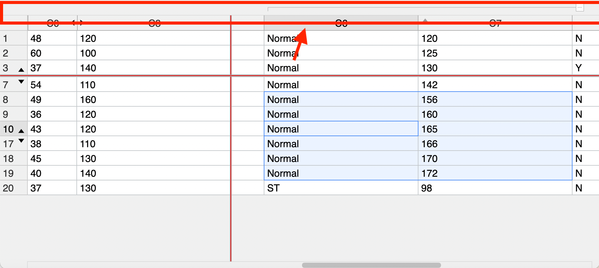

# How the grid is drawn

This document was written based on [version 4.2](https://github.com/TonyGermaneri/canvas-datagrid/tree/4e1e3dbe7ba70a3367bcefa38188af70cbb9f40f)

Most rendering code of this component are located in `lib/draw.js`.   
If you are the first time to read this file,
you can start reading this file from the line, which defines function `self.draw`.
(Find it by searching `self.draw =` in your editor)

The code in `self.draw` function are the rendering process.
And there are many util functions above this function.

You can see this function contains more than 2000 lines in your editor,
and it has many inner functions.

In order to understand and appreciate it. You can search `initDraw();` in your editor
to find the beginning of the core flow.
You will see the code of core flow like these:

``` javascript
self.ctx.save();
initDraw();
drawBackground();
initGroupArea();
drawFrozenRows();
drawRows();
drawActiveCell();
drawHeaders();
drawFrozenMarkers();
drawSelectionHandles();
drawReorderMarkers();
drawMoveMarkers();
drawBorder();
drawSelectionBorders();
drawScrollBars();
if (checkScrollHeight) {
  self.resize(true);
}
drawGroupArea();
drawDebug();
drawPerfLines();
if (self.dispatchEvent('afterdraw', {})) {
  return;
}
self.ctx.restore();
```

This document will explain this flow in the following sections.

# initDraw()

The code in `initDraw` and the code before are used for these purposes: 

- Trigger `beforedraw` event.
- Check for no need to draw.
- Initialize variables.

> Because many developers maintained this project, there are two parts initializing code in `self.draw`.
> - First part is followed the `self.draw = function (internal) {` closely 
> - Second part is the inner function `initDraw`

There are explaining for some important variables:

`visibleRows`, `visibleCells`, `visibleGroups`, `visibleUnhideIndicators`:   
These variables are used for storing the information of the latest rendering.  
This information contains coordinates, indexes and other meta information.  
And they are useful for event handlers and public methods. For example, the event handler can know what item user clicked by searching from them by mouse event coordinates.

`currentRowIndexOffset`, `rowIndexOffsetByHiddenRows`:   
These variables are used for correcting the titles of row headers if there are any hidden rows.   
You will see how they work in the inner function `drawRowHeader`.

## Preparatory knowledge for the following inner functions

### Various indexes

In this component, there are various indexes, which indicate the column and the row.
And it is easy to confuse them. Here is the explanation for some common index variables:

#### For Columns

`columnIndex`, the original index of the `schema`. You can use it as the subscript to access `self.schema`   
**But it has an exception**, the property called `columnIndex` in each item of the array `self.visibleCells` 
is actually a `columnOrderIndex`.    
(You can search `columnIndex: columnOrderIndex,` in your editor to find it)

`columnOrderIndex`, also named `viewColumnIndex`, it represents the column order after rendering.   
You can convert the `viewColumnIndex` to `columnIndex` by reading property `self.orders.columns`

``` javascript
const columnIndex = self.orders.columns[columnOrderIndex];
```
For the relationship between `columnIndex` and `columnOrderIndex`, the following example can explains intuitively:

We give the following schema to this component:

``` javascript
[{name: 'A'}, {name: 'B'}, {name: 'C'}, {name: 'D'}]
```

The result is

| Situation | `columnIndex` | `columnOrderIndex` |
|---|---|---|
| Initial state | A=0; B=1; C=2; D=3; | A=0; B=1; C=2; D=3; |
| After hiding column `B` | A=0; B=1; C=2; D=3; | A=0; **C=1**; **D=2**; |
| After moving column `C` to the front of the grid | A=0; B=1; C=2; D=3; | **C=0**; A=1; B=2; D=3; |

#### For Rows

`rowIndex`, also named `rowOrderIndex` and `viewRowIndex`, it represents the row order for rendering. the `rowIndex` of each rows are ordered, from small to large.    
And they are contiguous most of time except if any rows are hidden.

`boundRowIndex`, the original index of the `data`. You can use it as the subscript to access `self.data`.   
And there is a method named `self.getBoundRowIndexFromViewRowIndex` to convert `rowIndex` to `boundRowIndex`.

### Offset for drawing

You may see two variables about offsset named `canvasOffsetLeft` and `canvasOffsetTop` in the source code.   
They are used to determine which location of HTML `canvas` element to start rendering whole grid component, because this component has the ability to display embedded grid (aka. child grid).

So please remember to adding `canvasOffsetLeft` or `canvasOffsetTop` to the coordinate values before
drawing things on the canvas. Or you can using the util function whose defined before the `self.draw`
to drawing things, they have implemented offset calculations already.

## drawBackground()

As its name.

## initGroupArea()

This inner function only contains one line:

``` javascript
self.ctx.translate(rowGroupsAreaWidth, columnGroupsAreaHeight);
```

Because this component hasn't grouping feature util version 4.0, 
we used `ctx.translate` method to leave space for rendering group lines and group toggle icons.
This way can reduce changes to existing code.

## drawFrozenRows()

As its name. The UI looks like this screenshot after this method:


## drawRows()

As its name. The UI looks like this screenshot after this method:


You can see a slightly wider gap with color grey in the screenshot. It is not frozen marker(line), it is a space for rendering frozen marker later.

## drawActiveCell()

It draws the border of the active cell. This screenshot shows what has changed:


## drawHeaders()

As its name. It draws header for rows and header for columns.


## drawFrozenMarkers()

It draws frozen markers(red lines in the screenshot):


## drawSelectionHandles()

It draws the small rectangle handles over the corners of selection area on mobile.
So you can't find them in desktop browser in current version.

Related jsDoc:

> args.selectionHandleBehavior	 
> string   
> When set to a value other than none a handle will appear in the lower right corner of the desktop version of the grid. It does nothing but will be used in a future version of the grid.


## drawReorderMarkers()

It draws the following things when the user is dragging columns or rows to reorder:

- A grey translucent mask(overlay) over the grid.
- A marker(line) to indicator where will these columns/rows be placed after user released the mouse. (the blue vertical line in the screenshot)


## drawMoveMarkers()

It draws a dashed border to indicator where is the new selection area when the user is dragging a selection area.   
You can see a blue dashed border at the bottom right side of current selection area.


## drawBorder() and drawSelectionBorders()

They draw some borders.

## drawScrollBars()

As its name. It draws scroll bars by following property `self.scrollBox` if scroll bar should exist.


## drawGroupArea()

It draws the grouping indicators and lines above column headers and the area on the left side of row headers.

And this inner function uses the following variables to calculating the location of groupding indicators:

- `rowGroupsRectInfo`
- `rowGroupsFrozenInfo`
- `columnGroupsRectInfo`

These veriables are calculated from function `drawCell`, but more on that later on.

There is code to generating the property `self.visibleGroups` in this function. 
This property is an array, the type of each item is like this: 

``` typescript
type Item = {
  type: 'r'|'c', // a group for (r)ows, or a group for (c)olumn
  collapsed: boolean, // is this group collapsed
  from: number, // rowIndex or columnOrderIndex
  to: number,  // rowIndex or columnOrderIndex
  col?: number, // which column in this group area. only the group for rows has this property.
  row?: number, // which row in this group area. only the group for columns has this property.
  x: number,
  y: number,
  x2: number,
  y2: number, // rectangle area (x,y)-(x2,y2)
}
```



## drawDebug()

It draws debug text on topest layer of the grid when the value of attribute named `debug` is true.


## drawPerfLines()


It draws the box of performance info on topest layer of the grid when the value of attribute named `showPerformance` is true.


---

So far, the main flow of rendering is introduced. But we have not introduced an important function that is not at the top level in the main flow.   
This function is named `drawCell`, it is a higher order function. it returns a function that draws each cell in a row. 

## drawCell(rowData, rowOrderIndex, rowIndex)

Before reading the code in this function, you can find all its references in your editor. You can see these functions used it:

- `drawRowHeader`
- `drawHeaders`
- `drawRow`
- `drawRows`

And the relationship between these functions is like this:

- `drawFrozenRows`
  - It invokes the function `drawRow` for rendering each frozen row.
- `drawRows`
  - It invokes the function `drawRow` for rendering each normal row.
  - It invokes the function `drawCell` directly for rendering each cell in the blank new row.
- `drawRow`
  - It has two places where `drawCell` is invoked. first place is used for rendering normal cell, 
second place is used for rendering frozen cell.
- `drawHeaders`
  - It invokes the function `drawCell` for rendering column headers, the cell gap of column header and
the corner cell.
  - It invokes the function `drawRowHeader` for rendering row headers.
- `drawRowHeader`
  - It invokes the function `drawCell` for rendering row headers.

Now, we can have a look at the `drawCell` function. The parameters of it can be understood by their names.
And this function return a render function named `drawEach`:

``` javascript
function drawEach(header, headerIndex, columnOrderIndex) {
  // ...
}
```

The name of the first parameter named `header` can be confusing. 
Actually, its type is same as the item of property `self.schema`.
So you can set `schema[headerIndex]` or `schema[columnIndex]` as its value for the normal cells,
and create an object similar to schema item as its value for the header cells and corner cells.

Then, here is a list to explain how each property of this parameter affects rendering.

- `title`: It is a preferred text for the column header cell.
- `name`: It is a property key for extracting value from `rowData` to cell text for normal cells.
It is an alternative text for column header cells if the property `title` is empty.
- `type`: It decides how the cell is rendered and formatted. It can be one value of 
`'string'`, `'html'` and `'canvas-datagrid'`.
- `style`: It is a string representing the type of cell and the style. etc, `cell`, `rowHeaderCell` ...
- `width`: It is default width value for the cell.
  - Related code: `cellWidth = self.sizes.columns[headerIndex] || header.width`

Now, we start explaining the code in the function `drawEach`.

Before drawing the things of the cell, this function sets up the coordinate variables.

- `cx`: current x drawing cursor sub calculation var 
- `cy`: current y drawing cursor sub calculation var

Then it creates an object named `cell` with many context information. 
Next, it prepend this object into `self.visibleCells`.
And it save the information used for drawing group indicators to variable `rowGroupsRectInfo` and `columnGroupsRectInfo`.

After the code above, it assigns the color for the drawing context and calculates the size for the cell.
Next, it draws the cell's background, the cell's border, the cell's content and components over the cell in sequence.

Finally, it lets the variable `x` plus a value equal to the cell width and the border width.
Then return the cell's width.

## drawRow(rowOrderIndex, rowIndex)

This method draws the normal cells first. and it draws frozen cells next. 
So the frozen cells can cover the normal cells.

For normal cells part, it draws from the column whose `columnOrderIndex` is `self.scrollIndexLeft`
to the last columns. But we break this loop if the variable `x` is greater than the component's width.

Then this method renders all frozen columns. Then it assigns the latest `x` as 
the value of `self.lastFrozenColumnPixel`.

Before the end, it invokes the method `draw` of the child grid if there is a child grid of this row.

## drawRows()

It clips an area that doesn't contain the area of frozen rows if there are any frozen rows.

## Other instructions

### Where does the value of the variable named `scrollIndexLeft` come from?

It got the value from the method named `self.scroll`. 
This method is located in the file `events/index.js`.

Similarly, this method assign values to `scrollIndexTop`, `scrollPixelTop` and `scrollIndexLeft`.

And these values are calculated from `self.scrollBox` and `self.scrollCache`. 
For these two properties, you can read the function named `self.resize` and 
the function `self.scrollGrid` in the same file.

So from their names, you may have guessed this process:

- The event handler method named `self.resize` builds the size info/cache properties. 
- The event handler method named `self.scrollGrid` handles mouse events. And it assigns values 
for the properties of the `self.scrollBox` (Eg: `scrollLeft` and `scrollTop`)
  - The event handler is used in event handler `self.mousedown` like this: 
`document.addEventListener('mousemove', self.scrollGrid, false);`
- The `self.scroll` method is invoked in `self.resize` and other scroll-related methods. And it
re-calculates the properties for rendering. Then it invokes `self.draw` if the parameter `dontDraw` is not true.

