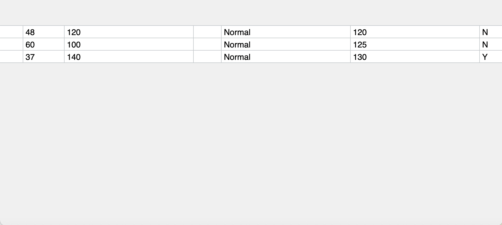

# How the Grid be Draw

This document was written based on [version 4.2](https://github.com/TonyGermaneri/canvas-datagrid/tree/4e1e3dbe7ba70a3367bcefa38188af70cbb9f40f)

Most rendering codes of this component are located in `lib/draw.js`.   
If you are the first time to read this file,
you can start reading this file from the line, which defines function `self.draw`.
(Find it by searching `self.draw =` in your editor)

The codes in `self.draw` function are the rendering process.
And there are many util functions above this function.

You can see this function contains more than 2000 lines in your editor,
and it has many inner functions.

In order to understand and appreciate it. You can search `initDraw();` in your editor
to find the beginning of the core flow.
You will see the codes of core flow like these:

``` javascript
self.ctx.save();
initDraw();
drawBackground();
initGroupArea();
drawFrozenRows();
drawRows();
drawActiveCell();
drawHeaders();
drawFrozenMarkers();
drawSelectionHandles();
drawReorderMarkers();
drawMoveMarkers();
drawBorder();
drawSelectionBorders();
drawScrollBars();
if (checkScrollHeight) {
  self.resize(true);
}
drawGroupArea();
drawDebug();
drawPerfLines();
if (self.dispatchEvent('afterdraw', {})) {
  return;
}
self.ctx.restore();
```

This document will explain this flow in the following sections.

# initDraw()

The codes in `initDraw` and the codes before are used for these purposes: 

- Trigger `beforedraw` event.
- Check for no need to draw.
- Initialize variables.

> Because many developers maintained this project, there are two parts initializing codes in `self.draw`.
> - First part is followed the `self.draw = function (internal) {` closely 
> - Second part is the inner function `initDraw`

There are explaining for some important variables:

`visibleRows`, `visibleCells`, `visibleGroups`, `visibleUnhideIndicators`:   
These variables are used for storing the information of the latest rendering.  
This information contains coordinates, indexes and other meta information.  
And they are useful for event handlers and public methods. For example, the event handler can know what item user clicked by searching from them by mouse event coordinates.

`currentRowIndexOffset`, `rowIndexOffsetByHiddenRows`:   
These variables are used for correcting the titles of row headers if there are any hidden rows.   
You will see how they work in the inner function `drawRowHeader`.

## Preparatory knowledge for the following inner functions

### Various indexes

In this component, there are various indexes, which indicate the column and the row.
And it is easy to confuse them. Here is the explanation for some common index variables:

#### For Columns

`columnIndex`, the original index of the `schema`. You can use it as the subscript to access `self.schema`   
**But it has an exception**, the property called `columnIndex` in each item of the array `self.visibleCells` 
is actually a `columnOrderIndex`.    
(You can search `columnIndex: columnOrderIndex,` in your editor to find it)

`columnOrderIndex`, also named `viewColumnIndex`, it represents the column order after rendering.   
You can convert the `viewColumnIndex` to `columnIndex` by reading property `self.orders.columns`

``` javascript
const columnIndex = self.orders.columns[columnOrderIndex];
```
For the relationship between `columnIndex` and `columnOrderIndex`, the following example can explains intuitively:

We give the following schema to this component:

``` javascript
[{name: 'A'}, {name: 'B'}, {name: 'C'}, {name: 'D'}]
```

The result is

| Situation | `columnIndex` | `columnOrderIndex` |
|---|---|---|
| Initial state | A=0; B=1; C=2; D=3; | A=0; B=1; C=2; D=3; |
| After hiding column `B` | A=0; B=1; C=2; D=3; | A=0; **C=1**; **D=2**; |
| After moving column `C` to the front of the grid | A=0; B=1; C=2; D=3; | **C=0**; A=1; B=2; D=3; |

#### For Rows

`rowIndex`, also named `rowOrderIndex` and `viewRowIndex`, it represents the row order for rendering. the `rowIndex` of each rows are ordered, from small to large.    
And they are contiguous most of time except if any rows are hidden.

`boundRowIndex`, the original index of the `data`. You can use it as the subscript to access `self.data`.   
And there is a method named `self.getBoundRowIndexFromViewRowIndex` to convert `rowIndex` to `boundRowIndex`.

### Offset for drawing

You may see two variables about offsset named `canvasOffsetLeft` and `canvasOffsetTop` in the source codes.   
They are used to determine which location of HTML `canvas` element to start rendering whole grid component, because this component has the ability to display embedded grid (aka. child grid).

So please remember to adding `canvasOffsetLeft` or `canvasOffsetTop` to the coordinate values before
drawing things on the canvas. Or you can using the util function whose defined before the `self.draw`
to drawing things, they have implemented offset calculations already.

## drawBackground()

As its name.

## initGroupArea()

This inner function only contains one line:

``` javascript
self.ctx.translate(rowGroupsAreaWidth, columnGroupsAreaHeight);
```

Because this component hasn't grouping feature util version 4.0, 
we used `ctx.translate` method to leave space for rendering group lines and group toggle icons.
This way can reduce changes to existing codes.

## drawFrozenRows()

As its name. The UI looks like this screenshot after this method:



## drawRows()

As its name. The UI looks like this screenshot after this method:


You can see a slightly wider gap with color grey in the screenshot. It is not frozen marker(line), it is a space for rendering frozen marker later.

## drawActiveCell()

It draws the border of the active cell. This screenshot shows what has changed:


## drawHeaders()

As its name. It draws header for rows and header for columns.


## drawFrozenMarkers()

It draws frozen markers(red lines in the screenshot):


## drawSelectionHandles()

It draws the small rectangle handles over the corners of selection area on mobile.
So you can't find them in desktop browser in current version.

Related jsDoc:

> args.selectionHandleBehavior	 
> string   
> When set to a value other than none a handle will appear in the lower right corner of the desktop version of the grid. It does nothing but will be used in a future version of the grid.


## drawReorderMarkers()

It draws the following things when the user is dragging columns or rows to reorder:

- A grey translucent mask(overlay) over the grid.
- A marker(line) to indicator where will these columns/rows be placed after user released the mouse. (the blue vertical line in the screenshot)


## drawMoveMarkers()

It draws a dashed border to indicator where is the new selection area when the user is dragging a selection area.   
You can see a blue dashed border at the bottom right side of current selection area.


## drawBorder() and drawSelectionBorders()

They draw some borders.

## drawScrollBars()

As its name. It draws scroll bars by following property `self.scrollBox` if scroll bar should exist.

## drawGroupArea()


