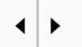
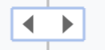

# Ability to hide rows/cols (#420)

<https://github.com/TonyGermaneri/canvas-datagrid/issues/420>

## New components in the grid

Add indicator(icon) named `UnhideIndicator` on column headers and row headers,
It looks like:

In normal status:  

In hover status:   

## New attributes

`showUnhideColumnsIndicator` and `showUnhideRowsIndicator`:

These two attributes are used to control the visibility of the `UnhideIndicator`.
Their default values are `false` because we need to ensure that there are no inexplicable icon will appear after some users upgrade this component from the old version.

## New styles

- `unhideIndicatorColor`: the foreground color of the indicator
- `unhideIndicatorBackgroundColor`: the background color of the indicator in hover status
- `unhideIndicatorBorderColor`: the border color of the indicator in hover status 
- `unhideIndicatorSize`: the indicator size(unit: px). this value represents the height of the indicator in this version.

## New context menu

- `Hide columns {}-{}`: when users select contiguous columns and trigger the context menu on column headers.
- `Hide rows {}-{}`: when users select contiguous rows and trigger the context menu on row headers.

## Under the hood

Add new codes in functions around rendering to check is their any contiguous hidden columns/rows. If there have, render an indicator on the related area and save the rectangle coords info of it to `visibleUnhideIndicators`.
